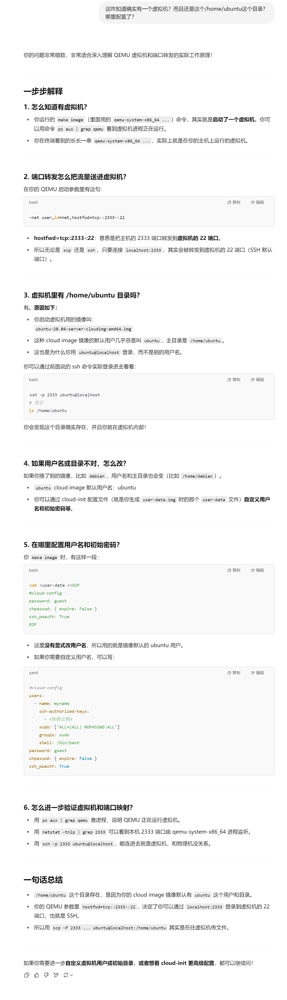

# RVM 1.5

[](https://github.com/rcore-os/RVM1.5/actions)

A Type-1.5 hypervisor written in Rust.

Drived by the driver from [Jailhouse](https://github.com/siemens/jailhouse).

Supported architectures: x86_64 (Intel VMX, AMD SVM).

[](https://asciinema.org/a/381240?autoplay=1)

## Getting Started

### Build

```
make [VENDOR=intel|amd] [LOG=warn|info|debug|trace]
```

### Test in QEMU (ubuntu as the guest OS)

1. Download the guest image and run in QEMU:

    ```bash
    cd scripts/host
    make image          # download image and configure for the first time
    make qemu           # execute this command only for subsequent runs
    ```

    You can login the guest OS via SSH. The default username and password is `ubuntu` and `guest`. The default port is `2333` and can be changed by QEMU arguments.

2. Copy helpful scripts into the guest OS:

    ```bash
    scp -P 2333 scripts/guest/* ubuntu@localhost:/home/ubuntu
    ```

3. Setup in the guest OS:

    ```bash
    ssh -p 2333 ubuntu@localhost    # in host
    ./setup.sh                      # in guest
    ```

4. Copy RVM image into the guest OS:

    ```bash
    make scp                        # in host
    ```

5. Enable RVM:

    ```bash
    ./enable-rvm.sh                 # in guest
    ```


scp -P 2333 scripts/guest/* ubuntu@localhost:/home/ubuntu
这个命令，ssh协议复制。



ssh -p 2333 ubuntu@localhost
相当于能多开了，但是如果你关掉qemu的那个，就会断开了

./setup.sh
make scp VENDOR=amd
./enable-rvm

第一行的是下载jailhouse
第二行就是拷贝hypervisor和简单的os（我觉得是这样吧）
第三行就是利用jailhouse启动hypervisor了

也就是这里大部分代码就是准备为jailhouse适配的hypervisor和简单的os？
我感觉我最后还是需要看一下，它那个type1.5的x86怎么实现的


# 踩的坑
/// 在rust的最前面和最后面不能写这个

